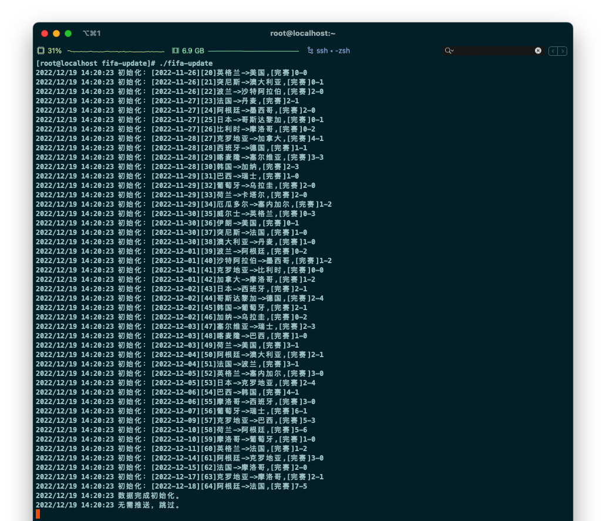

# 2022 世界杯赛况推送小工具




[[English Version](#2022-fifa-score-update)]

根据数据源，在赛况期间每 15 分钟，更新球赛数据，并推送到企业微信群中。

## Step 1. 准备材料

- 世界杯数据源 Api 接口
  - [聚合免费 API](https://www.juhe.cn/docs/api/id/616)
- 企业微信机器人 Api 接口
  - 新建群，右键添加机器人

## Step 2. 配置

### 接口配置

在 `main.go` 中，填充以下几个 API 地址：

- `FifaApi`: 聚合数据的 api 的地址
- `RobotApi`: 需要推送赛况的企业微信机器人 API
- `ErrReportApi`: 需要推送程序异常信息的企业微信机器人 API（可以和 `RobotApi` 相同）

### 监控节点配置

由于免费数据源 API 有 `50次/日` 请求限制，所以可以在 `main.go` 的 **timeMap** 中设定对应的监测点。

## Step 3. 部署

```bash
$ git clone https://github.com/copriwolf/fifa2022-score-update.git

$ cd fifa2022-score-update

$ go mod tidy && go build . 

$ ./fifa-update
```

---

# 2022 Fifa Score Update

According to the data source, every 15 minutes during the game, 
the game data is updated and pushed to the WeCom group.

## Step 1. Prepare Data Source

- Fifa 2022 Game Data API
  - [JuHe Free API](https://www.juhe.cn/docs/api/id/616)
- WeCom Bot API
  - Create a new group, right-click to add a robot 

## Step 2. Config

### API Config

In file `main.go`, config below api url：

- `FifaApi`: JuHe API
- `RobotApi`: WeCom Robot API
- `ErrReportApi`: WeCom Another API For Err Notice

### Time Point Config

Due to Free Fifa API have `50 times/per data` limit, 
you can config checking time point in file `main.go` => **timeMap**.

## Step 3. Deploy

```bash
$ git clone https://github.com/copriwolf/fifa2022-score-update.git

$ cd fifa2022-score-update

$ go mod tidy && go build . 

$ ./fifa-update
```